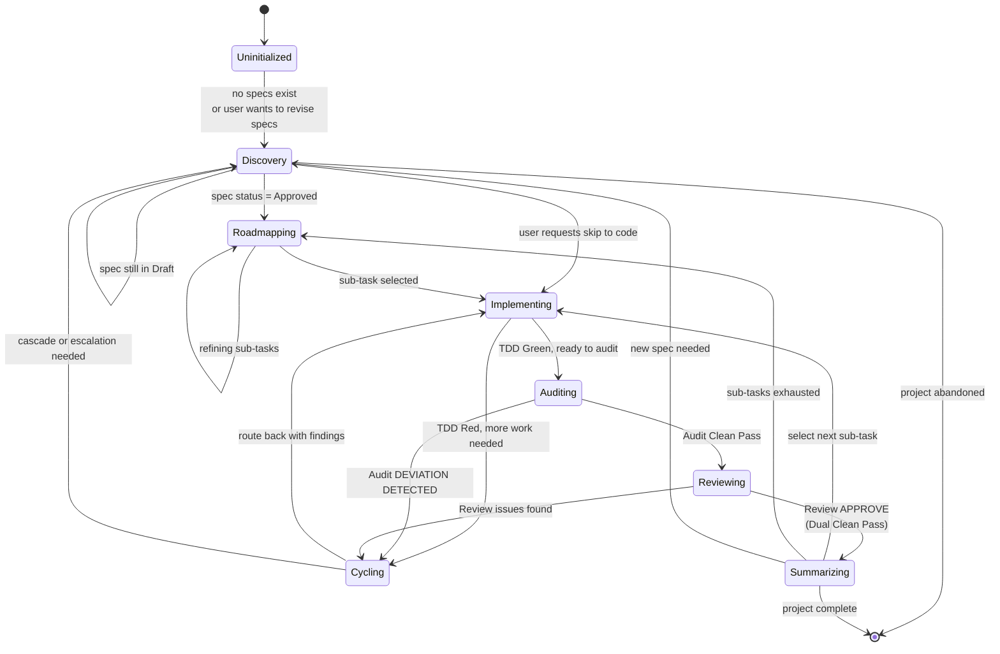

# Agentic Development Loop (Orchestrator)

> **Mental model:** _This skill is the orchestrator, not an executor. It routes between skills, gates transitions, handles cascades, and summarizes iterations. It does NOT produce artifacts itself — it delegates to other skills._

This skill is the **bi-directional feedback loop** for the Moatcraft workflow. Audit failures, code review findings, and mid-flight strategic shifts cycle back upstream until quality, spec fidelity, and brand alignment are locked.

---

## CHEAT SHEET — read this first, every iteration

### Routing priority (when in doubt, this order wins)

```
1. Onboarding (new project / unclear state)     → moatcraft-onboarding
2. Brand / spec work (no spec, or spec drift)   → brand-product-alignment / front-end-designer / backend-architect
3. Roadmap work (specs ready, need breakdown)   → progress-mapper
4. Execution (sub-task selected)                → implementation-tdd
5. Quality gates (after TDD Green)              → alignment-audit → code-review
6. Iteration close (dual clean pass)            → Loop Summary (this skill)
7. Ad-hoc "why" questions (any time)            → explain-and-teach
```

### Hard rules — NEVER violate

- **NEVER skip the state machine.** A skill is invoked only when its precondition state is met. No invoking `implementation-tdd` without a sub-task from `progress-map.md`. No invoking `code-review` without `alignment-audit` first.
- **NEVER invoke a skill when its inputs are stale.** If a spec is `Locked` and someone wants to refine the spec, that's a cascade trigger — do NOT silently edit the spec or the progress map.
- **NEVER present a Loop Summary unless BOTH `alignment-audit` AND `code-review` report Clean Pass.** One green and one red → cycle back, do not summarize.
- **NEVER bypass escalation.** If `implementation-tdd` discovers an unresolvable technical contradiction, escalation to `brand-product-alignment` or `backend-architect` is mandatory — not optional. The downstream skill cannot "make it work" by itself.
- **NEVER cycle back from `code-review` to `implementation-tdd` in Red mode.** Code-review issues are refactor/quality fixes, not new failing tests. Use Refactor Mode.
- **Loop Summary tone**: first-person, transparent, no sycophancy. Always close with "next" or "need your call".
- **Cascade protocol** is mandatory on any `Locked` → `Revised` transition. Re-open invalidated sub-tasks, re-audit in-progress work, inject corrective sub-tasks.
- **Status transitions are a state machine.** No skipping states, no implicit transitions.

### Current state check (run before each routing decision)

```
[ ] Current state: ___ (one of 8 states below)
[ ] Active branch: ___
[ ] Active spec statuses: brand=___, frontend=___, backend=___
[ ] Next pending sub-task: ___
[ ] Last 5-Layer Context Chain layer values: ___
[ ] Any spec `Locked` and changing? → cascade protocol required
[ ] Last Loop Summary emitted: ___ (iteration #N, date)
```

### The 8 states (the core)

| #   | State             | Trigger to enter                         | Next action                                                                     |
| --- | ----------------- | ---------------------------------------- | ------------------------------------------------------------------------------- |
| 1   | **Uninitialized** | Project has no specs, no onboarding done | Route to `moatcraft-onboarding`                                                 |
| 2   | **Discovery**     | Need to create or revise a spec          | Route to `brand-product-alignment` / `front-end-designer` / `backend-architect` |
| 3   | **Roadmapping**   | All relevant specs `Approved`            | Route to `progress-mapper`                                                      |
| 4   | **Implementing**  | Sub-task selected from `progress-map.md` | Route to `implementation-tdd`                                                   |
| 5   | **Auditing**      | TDD Green on current sub-task            | Route to `alignment-audit`                                                      |
| 6   | **Reviewing**     | Audit Clean Pass on current sub-task     | Route to `code-review`                                                          |
| 7   | **Cycling**       | Audit or Review found issues             | Cycle back to state 4 (`implementation-tdd`) with the findings                  |
| 8   | **Summarizing**   | Dual Clean Pass                          | Emit Loop Summary → return to state 3 (next sub-task) or state 2 (cascade)      |

---

## 1. The Orchestrator Mindset (this skill is different)

Most Moatcraft skills **produce artifacts**:

- `brand-product-alignment` → `brand-product-alignment-spec.md`
- `front-end-designer` → `front-end-design-spec.md`
- `backend-architect` → `backend-architecture-spec.md`
- `progress-mapper` → `progress-map.md`
- `implementation-tdd` → code + tests
- `alignment-audit` → `alignment-audit-report.md`
- `code-review` → code review report

**`agentic-dev-loop` does NOT produce an artifact.** It:

- **Routes** to the right skill based on state
- **Gates** transitions based on hard rules
- **Handles cascades** when specs change mid-flight
- **Emits the Loop Summary** (one piece of agent-authored output, on Dual Clean Pass)
- **Maintains the 5-Layer Context Chain** across skill invocations

If you find yourself writing artifacts in this skill, you're in the wrong skill. Delegate to the appropriate producer.

---

## 2. The State Machine (the core decision logic)



### State transition rules

| From           | To             | Trigger                       | Guard                                   |
| -------------- | -------------- | ----------------------------- | --------------------------------------- |
| Any            | `Discovery`    | Spec is `Locked` and changing | Cascade protocol MUST run first         |
| Any            | `Cycling`      | Audit or Review found issues  | Carry findings into next `Implementing` |
| `Implementing` | `Auditing`     | All tests Green, branch ready | `git status` clean, no uncommitted work |
| `Auditing`     | `Reviewing`    | Audit reports `Clean Pass`    | Audit report committed to spec log      |
| `Reviewing`    | `Summarizing`  | Review reports `APPROVE`      | Both gates passed                       |
| `Summarizing`  | `Implementing` | More sub-tasks pending        | Append to `## Iteration Log` first      |

---

## 3. Routing Decision Logic (which skill to invoke when)

This is the operational heart. Use this table when you need to decide what to do next.

| If current state is... | And the trigger is...                                 | Then route to...                                                                              | With what context...                      |
| ---------------------- | ----------------------------------------------------- | --------------------------------------------------------------------------------------------- | ----------------------------------------- |
| `Uninitialized`        | First time in project                                 | `moatcraft-onboarding`                                                                        | Empty 5-Layer Context                     |
| `Uninitialized`        | User asks specific design/brand/architecture question | Skip to relevant skill                                                                        | Ingest 5-Layer Context if any specs exist |
| `Discovery`            | Need to define or refine brand                        | `brand-product-alignment`                                                                     | Brand spec status (create or update)      |
| `Discovery`            | Need to define or refine UI/visual                    | `front-end-designer`                                                                          | Brand spec as input, frontend spec status |
| `Discovery`            | Need to define or refine backend                      | `backend-architect`                                                                           | Brand spec as input, backend spec status  |
| `Roadmapping`          | Specs ready, need breakdown                           | `progress-mapper`                                                                             | All relevant specs, with statuses         |
| `Implementing`         | Sub-task selected, no work yet                        | `implementation-tdd`                                                                          | Sub-task ID, target spec, test runner     |
| `Implementing`         | TDD Green, ready to audit                             | `alignment-audit`                                                                             | Sub-task ID, `git diff main...HEAD`       |
| `Auditing`             | Audit reports Clean Pass                              | `code-review`                                                                                 | Sub-task ID, audit report, `git diff`     |
| `Reviewing`            | Review reports APPROVE                                | Emit Loop Summary (this skill)                                                                | Sub-task ID, audit + review reports       |
| `Cycling`              | Audit/Review findings present                         | `implementation-tdd` (Refactor Mode)                                                          | Findings, `git diff` (unchanged)          |
| `Cycling`              | Spec change required                                  | Cascade protocol, then `brand-product-alignment` / `front-end-designer` / `backend-architect` | Which spec, what changed                  |
| `Cycling`              | Unresolvable technical contradiction                  | Upstream escalation to source skill                                                           | The contradiction, evidence               |
| Any                    | User asks "why" or wants rationale                    | `explain-and-teach`                                                                           | The decision being asked about            |

---

## 4. The 5-Layer Context Chain (operational)

Every skill invocation receives a 5-Layer Context Chain. The orchestrator (this skill) **constructs it on entry** and **passes it to the next skill**. Sub-skills do not reconstruct it from scratch.

### Schema (canonical)

```markdown
1. **Product & Brand Understanding**: App purpose, target audience, brand
   positioning, core boundaries (from `brand-product-alignment-spec.md`).
2. **Active Branch & Target Scope**: Current Git branch (e.g. `feat/auth-flow`),
   target milestone, optional tracker issue (`#123`).
3. **Phase Objective**: The specific high-level capability or architectural
   goal for the current cycle.
4. **Active Task & Spec Contracts**: Target sub-task requirements from
   `progress-map.md` and the relevant spec artifacts.
5. **Execution & Harness Constraints**: Test runner configuration, diff
   boundary (`git diff main...HEAD`), active audit constraints.
```

### Where the orchestrator reads from

| Layer | Source                                                                        |
| ----- | ----------------------------------------------------------------------------- |
| 1     | `brand-product-alignment-spec.md` § 1, § 2, § 4                               |
| 2     | `git branch --show-current`, `progress-map.md` Milestone header               |
| 3     | `progress-map.md` active Phase Objective, or current iteration's spec section |
| 4     | `progress-map.md` active sub-task, plus relevant spec sections                |
| 5     | `progress-map.md` Execution Overview, `package.json`/`pyproject.toml`/etc.    |

### Where the orchestrator updates

- Layer 3 (Phase Objective) updates when state transitions to a new iteration
- Layer 4 (Active Task) updates when sub-task changes
- Layer 5 (Harness) updates if the user changes test runner

### Anti-pattern

❌ Each sub-skill re-deriving the context from scratch. This is what the canonical schema was created to prevent.

---

## 5. Cascade & Escalation Protocol

When specs change or contradictions are discovered, the loop must re-align without losing auditability.

### Downstream cascade (top-down shift)

**Trigger:** A spec in an upstream layer changes.

```
brand-product-alignment-spec.md changes
  ↓ cascade
  • front-end-design-spec.md flagged for re-audit
  • backend-architecture-spec.md flagged for re-audit
  • After specs updated → progress-mapper re-audits progress-map.md
  • In-progress sub-tasks re-evaluated
  • New sub-tasks injected if needed
```

**Implementation steps:**

1. Identify which downstream specs are affected by the upstream change
2. Mark each affected spec as `Revised` (was `Locked`)
3. Re-run the relevant discovery skill for each
4. Re-run `progress-mapper` to update `progress-map.md`
5. Re-open invalidated completed sub-tasks (`[x]` → `[ ] Reopened: [Reason]`)
6. Re-audit in-progress sub-tasks against the new spec
7. Append a `## Revision History` line to each affected spec

### Upstream escalation (bottom-up escalation)

**Trigger:** A downstream skill discovers an unresolvable contradiction.

| Discovered contradiction                                       | Escalate to               |
| -------------------------------------------------------------- | ------------------------- |
| Technical contradiction (impossible SLA, infrastructure limit) | `backend-architect`       |
| Brand / positioning mismatch (moat contradicts implementation) | `brand-product-alignment` |
| Frontend/visual contradiction (UX 101 vs brand)                | `front-end-designer`      |

**Implementation steps:**

1. Stop the current sub-task cycle
2. Document the contradiction with evidence
3. Route to the appropriate upstream skill with the documented contradiction
4. The upstream skill resolves (revises spec, or confirms no change needed)
5. If spec changes → cascade protocol runs
6. If spec unchanged → return to `Cycling` state with the resolution

### Decision rule: cycle back vs escalate

```
Is the contradiction resolvable within the current sub-task's scope?
  YES → cycle back to implementation-tdd (refactor or fix)
  NO, requires spec change → cascade to upstream skill
  NO, requires brand/business decision → escalate to user
```

---

## 6. Rollback & Fix-Forward Protocol

When audit or review fails, choose the right recovery strategy.

### Fix-Forward (default for minor issues)

**When:**

- 🔵 Medium severity gaps from `alignment-audit`
- ⚪ Low severity gaps from `alignment-audit`
- Any `code-review` quality finding (naming, refactor, edge case)

**How:**

- Stay on the current feature branch
- Add new commits: `refactor(scope): ...` or `fix(scope): ...`
- Re-run the failed gate after the fix
- Cycle back to that gate (not the start of the loop)

### Revert & Rescope (for critical issues)

**When:**

- 🔴 Critical severity from `alignment-audit` (spec blocker, scope creep)
- Unapproved architectural pivot discovered

**How:**

- `git revert` the offending commits (preferred) or `git reset` the branch
- Re-align with the current spec
- Re-implement cleanly
- If the spec itself was wrong → trigger cascade to upstream

### Decision rule

```
What's the severity?
  🔴 Critical → Revert & Rescope (or cascade if spec is wrong)
  🟡 High     → Fix-Forward with `fix(...)` commit
  🔵 Medium   → Fix-Forward with `refactor(...)` commit
  ⚪ Low      → Fix-Forward or note for follow-up
```

---

## 7. Loop Summary Step (Phase 4 — the one artifact this skill produces)

The Loop Summary is the **only piece of output the orchestrator produces directly**. It fires once per iteration, on Dual Clean Pass.

### Trigger condition (BOTH must be true)

- ✅ `alignment-audit` → `Clean Pass` (or `Pass with Warning` only)
- ✅ `code-review` → `APPROVE` (with all Critical/High resolved)

If EITHER fails → do NOT emit summary. The loop cycles back to `implementation-tdd`. The user sees only the audit/review output.

### Console output (natural voice, max 4-6 lines)

Structure (one of three openers):

1. **`✅ Done — [plain task name]`** (clean pass)
2. **`🔄 Loop open — [plain task name]`** (cycled back, no user action needed)
3. **`🚨 Blocked — [plain task name]`** (needs user input)

Body:

1. **What shipped / attempted** — 1-2 sentences, first-person
2. **Status** — tests + audit + review, all green OR what's blocking
3. **Flag (optional)** — anything worth knowing; framed as a question if it needs user input
4. **Next** — plain-language next task + rough size estimate

### Tone rules (hard, not soft)

- ✅ First-person: "Shipped", "Added", "Fixed", "Hit a wall"
- ✅ Concept-level, not syntax: "rate limit" not "throttle handler"
- ✅ Acknowledge deviations transparently
- ✅ Always close with "next" or "need your call" — never leave hanging
- ❌ No sycophantic filler ("Great work!", "Excellent!", "Well done!")
- ❌ No bullet salad over 5 items
- ❌ No robotic phrasing ("Sub-Task X.Y.Z has been successfully completed")
- ❌ No metric dumps without narrative ("12/12" without "Shipped the reset flow")

### Audit trail output (always emit in parallel)

Append to `## Iteration Log` in `progress-map.md`:

```markdown
### Iteration #N — YYYY-MM-DD

- **Sub-Task:** [ID] — [plain name]
- **Status:** ✅ Clean Pass / 🔄 Cycled Back / 🚨 Blocked
- **Branch:** `feat/...` (merged / in progress)
- **Commits:** [count] (Red + Green + [follow-up])
- **Tests:** [N]/[N] passing
- **Audit findings:** 0C / 0H / [N]M / [N]L
- **Review findings:** 0C / 0H / [N]M / [N]L
- **Notes:** [same context as console summary, in a sentence form]
- **Next:** [next sub-task ID + name]
```

### Output channels (always emit to all three)

| Channel                              | Format                                 | Audience               |
| ------------------------------------ | -------------------------------------- | ---------------------- |
| Console                              | Natural voice (max 4-6 lines)          | User, this iteration   |
| `progress-map.md` `## Iteration Log` | Structured entry                       | Persistent audit trail |
| `progress-map.md` task checkbox      | `[x] Sub-Task X.Y.Z (Commit: a1b2c3d)` | Roadmap tracking       |

After the summary fires, the loop returns to state 3 (`Roadmapping` → `Implementing`) to select the next sub-task.

---

## 8. Failure Modes — orchestration playbook

When the loop gets stuck or something goes wrong, here's how to recover.

| Symptom                                                       | Cause                                                             | Recovery                                                                                                                |
| ------------------------------------------------------------- | ----------------------------------------------------------------- | ----------------------------------------------------------------------------------------------------------------------- |
| Loop cycles indefinitely between `Implementing` and `Cycling` | Same finding keeps recurring — root cause is in spec, not in code | Escalate to upstream spec skill. Do NOT keep refactoring the same code.                                                 |
| `alignment-audit` says "spec is wrong"                        | Spec was written without enough discovery                         | Stop, route back to discovery skill, revise spec, cascade                                                               |
| `code-review` finds issues every cycle                        | Sub-task is too coarse; review surface is too large               | Decompose sub-task in `progress-mapper`                                                                                 |
| Cascade protocol runs but `progress-map.md` is unchanged      | `progress-mapper` didn't re-read specs before regenerating        | Force re-read by deleting the roadmap and regenerating                                                                  |
| User says "skip the audit"                                    | User wants to ship fast                                           | Refuse politely. "Skipping audit removes the gate that catches spec drift. 5 minutes for the audit saves a wrong-ship." |
| User says "skip the code review"                              | Same as above                                                     | Same refusal. Review is the quality gate.                                                                               |
| Two specs contradict each other                               | Mid-flight revision in one spec didn't cascade                    | Run cascade protocol explicitly; both specs need to be in sync                                                          |
| Upstream skill can't resolve the contradiction                | The contradiction is brand/architecture, not technical            | Escalate to user with a clear trade-off (A→B→C structure)                                                               |
| Loop Summary fires but no `## Iteration Log` entry was added  | Orchestrator skipped the audit trail step                         | Add the entry now; do not let the trail stay inconsistent                                                               |
| Branch is dirty when transitioning to `Auditing`              | Implementation-tdd left uncommitted work                          | Stop, route back to `implementation-tdd` to commit first                                                                |
| 5-Layer Context Chain is stale (layer 1 from old brand spec)  | Brand spec was revised, but context chain wasn't updated          | Reconstruct layer 1 from current `brand-product-alignment-spec.md`                                                      |
| User wants to abandon a sub-task                              | Strategic change                                                  | Cycle to `Discovery` with explicit "abandoned" note in `progress-map.md`                                                |
| Specs and progress-map disagree on which sub-tasks exist      | Cascade ran but didn't propagate fully                            | Manually reconcile; do not pretend they agree                                                                           |

### When to escalate out of orchestration

- **Skill-level bug** (a sub-skill is producing wrong output) → file a fix, work around in the meantime
- **Project-level decision** (cancel the project, pivot entirely) → user decision
- **Tool-level failure** (git, test runner, environment) → debug outside the loop

---

## 9. Worked Examples — orchestration scenarios

### Example A: New feature flow (happy path)

```
State: Uninitialized
Trigger: User says "I want to build [feature]"
→ Route to moatcraft-onboarding
→ User signs off on project structure
State: Discovery
→ Route to brand-product-alignment (5-Layer Context: empty)
→ Spec created and approved
→ Route to front-end-designer (if UI) and/or backend-architect (if infra)
→ Both specs approved
State: Roadmapping
→ Route to progress-mapper with all 3 specs as input
→ progress-map.md created with atomic sub-tasks
State: Implementing
→ Route to implementation-tdd for Sub-Task 1.1
→ TDD Green, branch clean
State: Auditing
→ Route to alignment-audit with git diff
→ Audit Clean Pass
State: Reviewing
→ Route to code-review with same git diff
→ Review APPROVE
State: Summarizing
→ Emit Loop Summary (console + Iteration Log)
→ Check progress-map for next sub-task
State: Implementing (sub-task 1.2)
... (loop continues)
```

### Example B: Mid-flight spec change (cascade)

```
State: Implementing (Sub-Task 2.3, in progress)
Trigger: User says "we need to change the brand — we're now playful, not serious"
→ Upstream cascade triggered
→ Stop current sub-task
→ Route to brand-product-alignment
→ Brand spec updated: Draft → Approved (user signs off on revision)
→ Spec status: brand spec is now Revised
→ Cascade runs: front-end-design and backend-architecture specs flagged for re-audit
→ Route to front-end-designer
→ Frontend spec re-evaluated against new brand
→ Frontend spec updated and approved
→ Same for backend
→ Route to progress-mapper
→ progress-map.md re-audited
→ Sub-Tasks 2.3 (in progress) re-evaluated against new specs
→ If invalidated: revert & re-implement
→ If compatible: continue with new constraints noted
→ Continue loop
```

### Example C: Unresolvable contradiction (escalation)

```
State: Implementing (Sub-Task 4.1, in progress)
Discovery: code requires a tech that backend spec prohibits
→ Cannot cycle back (same contradiction will recur)
→ Upstream escalation triggered
→ Document the contradiction with evidence
→ Route to backend-architect
→ Backend-architect either:
  (a) revises spec to allow the tech (cascade then re-runs)
  (b) confirms prohibition, agent must find different implementation
→ If (a): cascade as in Example B
→ If (b): return to implementing with new constraint, attempt different approach
```

### Example D: Quality breach (cycling)

```
State: Reviewing
Trigger: code-review finds 2 Critical + 1 High
→ Cycle back to implementation-tdd (Refactor Mode)
→ Do NOT enter Red mode (this isn't a missing spec)
→ Refactor to address the findings
→ New commits: refactor(scope): ...
→ Branch still clean
→ Route back to alignment-audit (not code-review yet)
→ Audit Clean Pass again
→ Route to code-review with updated diff
→ Review APPROVE
→ Emit Loop Summary
```

---

## 10. Git & Loop Hygiene

### Branch conventions

- `feat/<task-slug>` for new features
- `fix/<issue-slug>` for bug fixes
- `refactor/<scope>` for pure refactors
- `docs/<spec-name>` for spec-only changes
- Never commit to `main` directly

### Commit conventions

- `test(scope): ...` — Red commit (failing tests written)
- `feat(scope): ...` — Green commit (implementation passes tests)
- `refactor(scope): ...` — Code quality fix (no behavior change)
- `fix(scope): ...` — Bug fix
- `docs(brand|backend|frontend): ...` — Spec change
- `chore(loop): ...` — Loop hygiene (iteration log entries, progress-map updates)

### Issue/PR linkage

- Sub-task commits reference the issue: `Closes #123`
- Spec-only commits use `Refs #123` (do not close the implementation issue)

### Status updates

- Update `progress-map.md` checkboxes on Dual Clean Pass: `[x] Sub-Task X.Y.Z (Commit: <sha>)`
- Append to `## Iteration Log` on every summary
- Update spec `## Revision History` on every status transition

---

## 11. Anti-sycophancy reminder (applies to this skill too)

The orchestrator is not a cheerleader. It does not exist to:

- Make the user feel good about skipping gates
- Agree that an audit was "probably fine" when it found issues
- Skip the Loop Summary to "save time"
- Soften a critical finding to avoid friction
- Pretend the loop is closed when one gate is still red

If a gate fails, it fails. Report it. Cycle back. Don't summarize around it.
